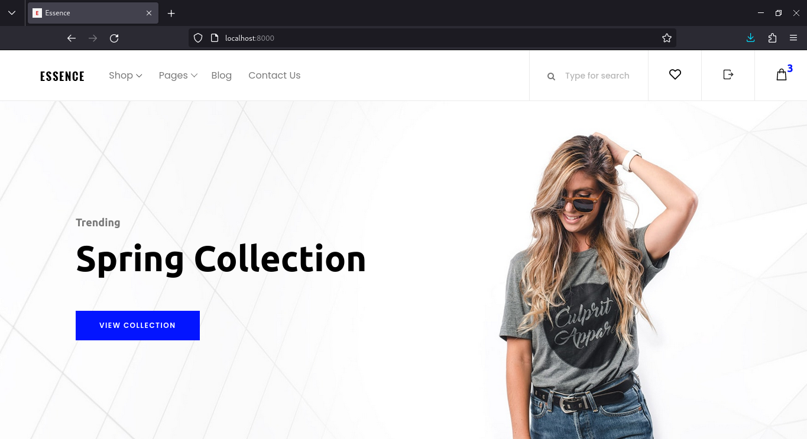
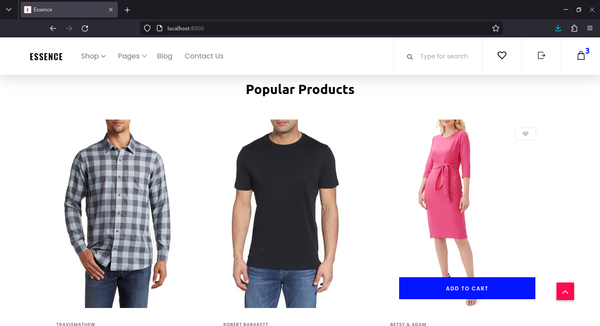
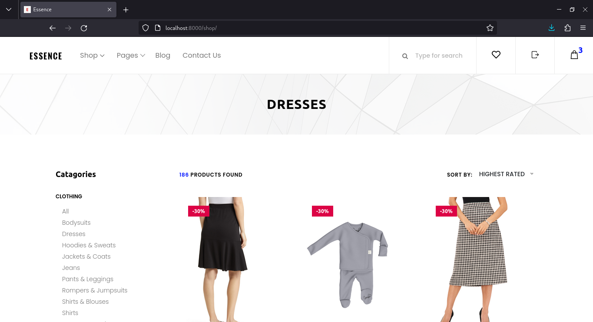
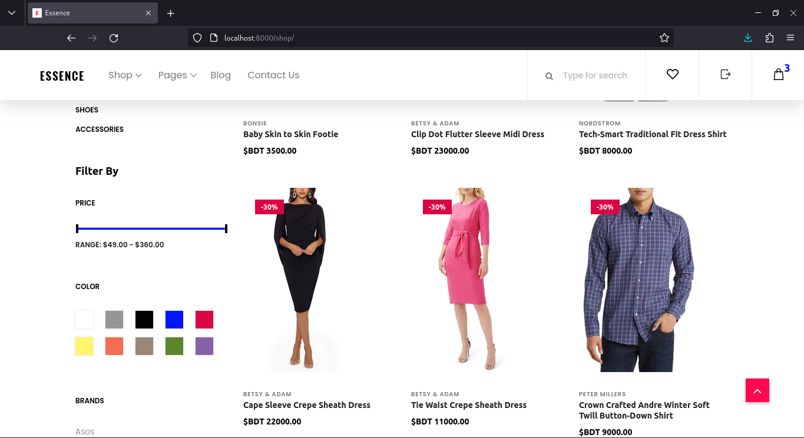
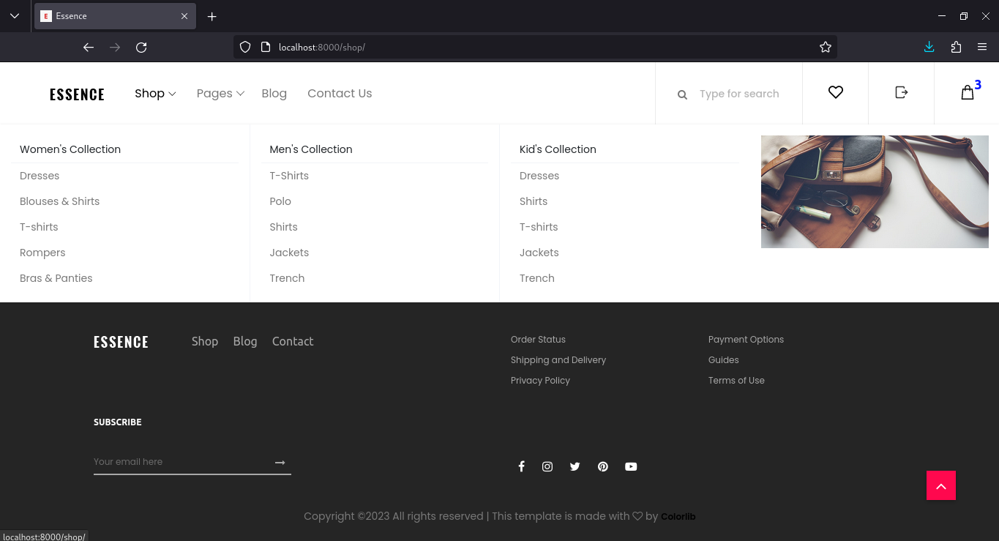
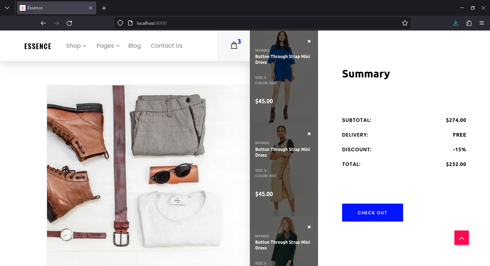
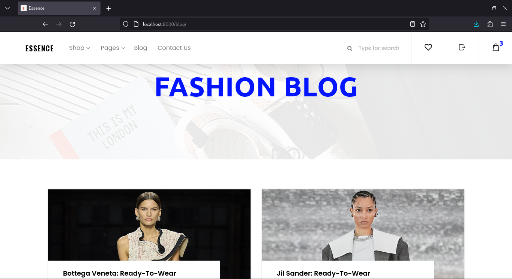
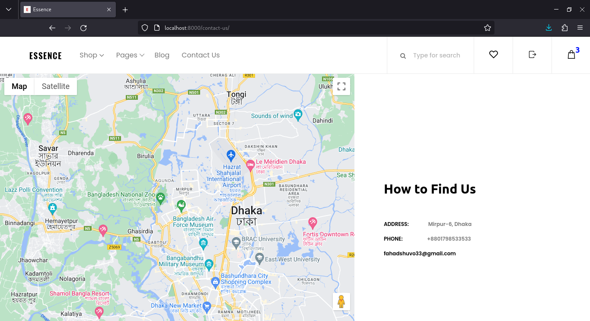

# Django_Simple_E-commerce

### *** Deprecation warning ***

I created this project after i learn django. There is a lot of things i didnot do in this project. But it was a great experience.

---

## Image Overview
[
<table>
  <tr>
    <td></td>
    <td></td>
  </tr>
  <tr>
    <td></td>
    <td></td>
  </tr>
    <tr>
    <td></td>
    <td></td>
  </tr>
    <tr>
    <td></td>
    <td></td>
  </tr>
</table>

## Templates Source

I couldn't understand web design then, so i had to download open source templates for my Project. Here are the templates source.<br>
[Login Templates](https://colorlib.com/wp/template/login-form-17/)<br>
[Registaration Templates](https://colorlib.com/wp/template/signup-form-15/)<br>
[Website Templates](https://github.com/ravi2krishna/ecomm)<br>


## Project Summary

User can create account and log in to their account. Products are generated from the server. There are also blogs which is also from the server. From admin-panel you can add products and blog which all the users can see.

---

## Running this Project

To run this project on your system, follow these instructions:

1. Clone or download this repository to your local machine:

```
git clone https://github.com/fahadshuvo33/Django_Simple_E-commerce.git
```


2. Navigate to the project folder:


```
cd Django_Simple_E-commerce-main/Django
```


3. Activate the virtual environment:

- On macOS/Linux:

  ```
  source bin/activate
  ```

- On Windows:

  - In cmd.exe:

    ```
    bin\activate.bat
    ```

  - In PowerShell:

    ```
    bin\Activate.ps1
    ```

4. Change to the project directory:

```
cd e_commerce_web/
```

5. Run the project:

```
python manage.py runserver
```
This will start the development server, and you can access the project in your web browser at [http://localhost:8000/](http://localhost:8000/).

---

